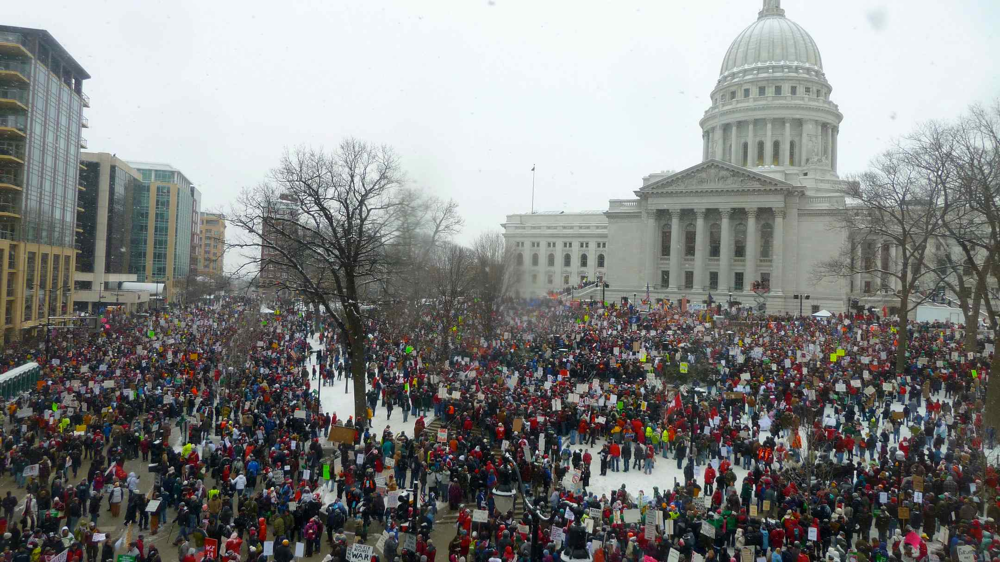

## The Democratic Promise

> When among the happiest people in the world, bands of peasants are seen 
> regulating affairs of State under an oak, and always acting wisely, can we 
> help scorning the ingenious methods of other nations, which make themselves 
> illustrious and wrteched with so much art and mastery? ~ Rosseau

## An Alternative View

> In the first place, God made idiots. That was for practice. Then he made school 
> boards. 

~ Mark Twain

## School Boards
- Most often, a locally elected body of 3-9 community members who make decisions 
on behalf of local school district
- Power to set property taxes, decide on curricula, hire and fire district leadership
- Powers available vary from state to state, WI school boards nominally have high power
- Together they represent tens of thousands of elected officials jointly 
responsible for spending hundreds of billions in local, state, and federal 
tax dollars

## Why are they interesting for political science?

- One of most common elected offices in the U.S. 
- Elected officials in special jurisdictions
- Much greater variety in jurisdiction type than other elected offices
- Specialized focus on a major public policy area
- Increasingly targets of centralizing and decentralizing reforms

## Previous Literature

> - Not much political science and little democratic theory
> - One time studies of one facet of school district politics
> - Lack of focus on voter and candidate behavior
> - Most studies refuted by saying, ``yes, but if we study for a longer period 
of time, conflict will emerge''

## My Approach

- Consider school districts within a state a system
- Observe school board elections over time, across the system
- Combine with diverse set of school district attributes
- Look for variation in participation, voter turnout, and board member defeat
- Look for attributes that explain, or, are predicted by school board election 
activity
- More data, more contexts, more elections, over a longer period of time than 
previous studies

## Why statewide?

- Lots of studies have focused on urban school districts, but the majority of 
elected officials who serve as school board members serve in small communities
- For every Madison, there are 40-50 school boards serving smaller communities

## Lots of Districts

## Why Study School Boards in Wisconsin Now?

- Advantage of data collection
- Boards retain power in Wisconsin
- Lots of variety (from Milwaukee to Norway J7)
- Possibility of some causal leverage due to statewide political upheaval

## Theory

## Main Questions

- When are board elections contested?
- What drives voter turnout?
- Did statewide political unrest alter school board election participation?
- Do school board election results matter?

## Theory

- School boards have high democratic potential; cheap, few votes needed to win, 
easy requirements to get on ballot, no partisan gatekeepers
- School boards also have low actualized democratic behavior; lack of interest, 
off-cycle, low information available
- With certain pressure, school boards should see great democratic potential 
met

## Data Collection

To answer these questions, I collect data from a number of sources. Most 
importantly -- school district election results. 

- 4,000 election race records
- 13,177 unique candidate-election records
- 6,100 unique candidates
- 310 school districts (out of 424); 7-10 election cycles
- Most districts have 10 years of records

## Key barrier to study

- Records are solely maintained by school districts
- Retention required for 10 years, but compliance is spotty
- Record keeping practices vary in comprehensiveness and format
- Nothing is digitized

## Additional Data

- Administrative records on school district characteristics
- Panel of ten years of consistent measures
- Diverse set of measures 
- Census demographic information
- Political and fiscal information aggregated from MCDs

## Causal Leverage

- Shock provided by Act 10

## Leverage

## Timeline

## Major Results

>- Small communities have very little school board contestation, but high profile 
fiscal decisions explain challenges to board seats
>- Turnout in board elections, while reduced, has many of the same demographic and 
community predictors as national and state elections
>- Voters in non-partisan spring elections are unlikely to be representative of 
wider community or fall general electorate in many communities
>- Act 10 and the wider state debate over education policy had only weak and 
sporadic effects on school board elections across the state
>- Board elections have no impact on student performance, but some evidence of 
impact on superintendent retention decisions and tax rates

## Limitations

- Most variability in democratic measures of school boards are explained by 
unobservable district characteristics
- Lack of information about voter preferences or rationales
- Too soon after Act 10 to fully encapsulate effects
- One state with specific features

## Questions
